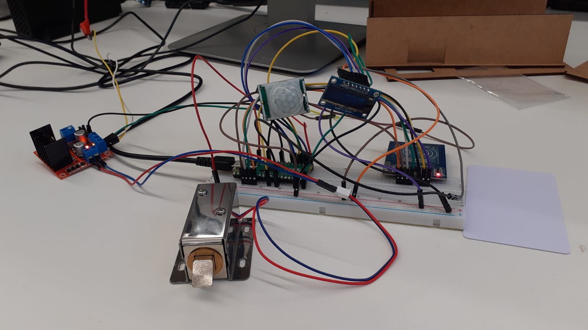
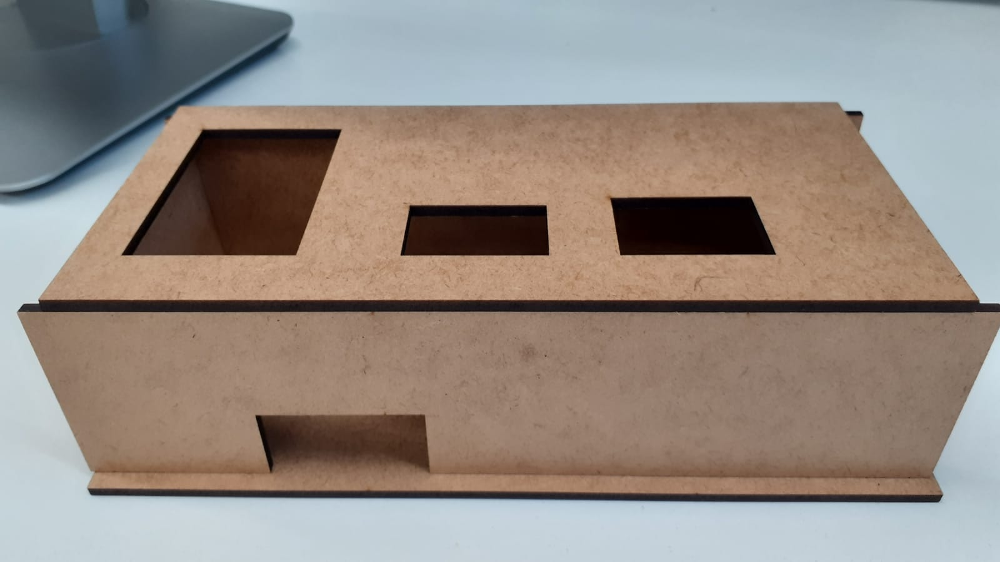
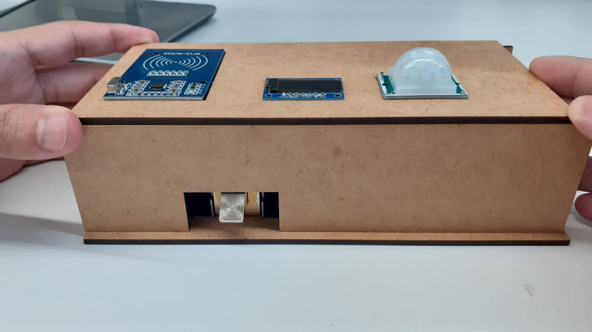

# Trabalho T1 EEN251 - SmartHome

## Integrantes do grupo
Fernando Laiser F Kon                                   RA: 19.01336-0

Guilherme Cury Galli                                    RA: 19.00374-9

Matheus dos Santos Galbiati                             RA: 19.01324-8

## Projeto desenvolvido

A ideia central de nosso projeto foi criar uma fechadura eletronica utilizando um sensor de RFID. Além disso, também foi idealizado um pequeno sistema baseado no acendimento de um display OLed quando um sensor de presença é acionado.

[Link do vídeo do projeto em execução](https://youtu.be/qG4GmPUp0S4)

### Foto do circuito criado

### Imagens da caixa externa ao circuito criada em mdf

Foram utilizados os seguintes componentes eletrônicos:

- Raspberry PI Pico
- Ponte H L298N
- Sensor de presença PIR DYP-ME003
- Sensor RFID Mfrc522
- Painel OLED
- Protoboard
- Jumpers variados
